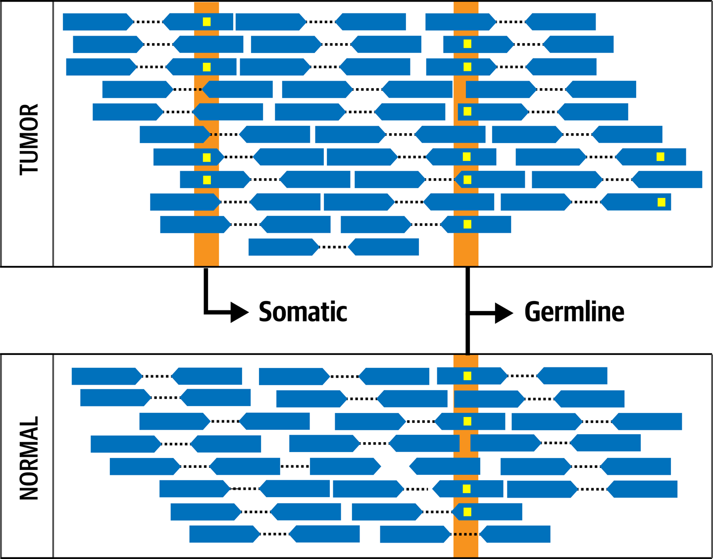
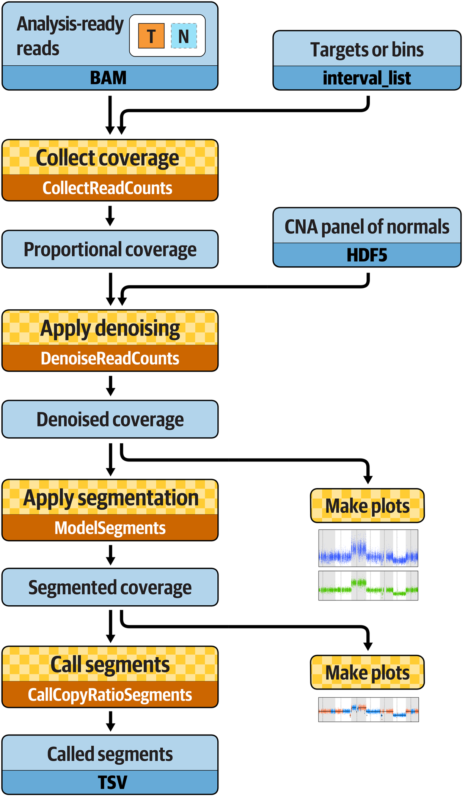
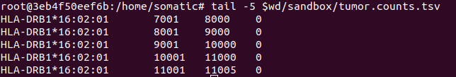
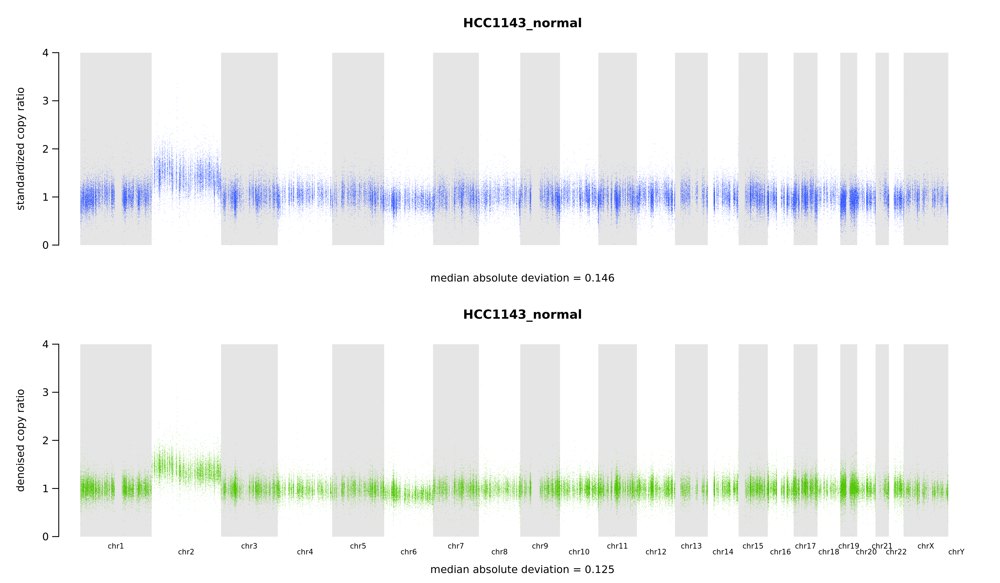
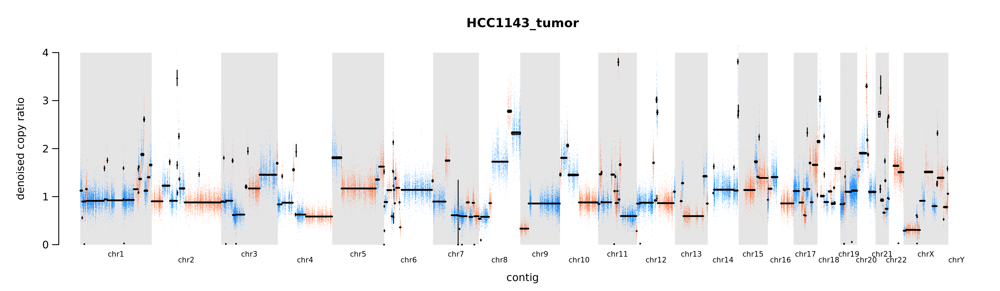
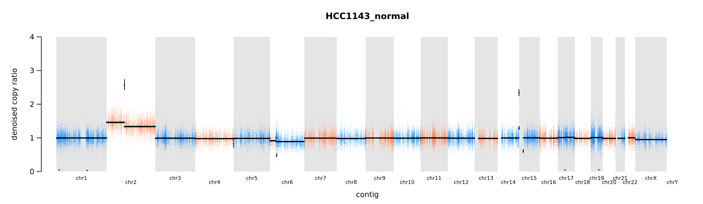
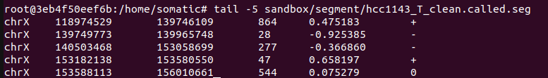

# Somatic CNV Discovery From the Book of Genomics in the Cloud 

>**Reference**: 
- [Genomics-in-the-Cloud Book](https://www.amazon.com/Genomics-Cloud-GATK-Spark-Docker/dp/1491975199)

>**Requirement**:
- [Google Cloud Command](https://pandeynandancse.medium.com/install-gcloud-gsutil-on-ubuntu-b3d39e18f94)
- [Docker](https://davetang.org/muse/2019/12/24/execute-gatk-workflows-locally/)


---


# Introduction
>**Illustration of Somatic Variant**


>**Pipeline**:




----

# Running Scripts using Local Machine

## 1. Copy Data from Google cloud to local machine

``` bash
$cd /home/sslamet/Tulane/fly-lab/Courses/gatk-in-the-cloud
$mkdir book
$gsutil -m cp -r gs://genomics-in-the-cloud/v1/* book/
cd book
$git clone https://github.com/broadinstitute/genomics-in-the-cloud.git code
$cd ~/book/code
$git pull
```


---

## 2.  Prepare Docker to work with GATK (& its dependencies)

```bash
#Set working directory
$export wd='/home/sslamet/Tulane/fly-lab/Courses/gatk-in-the-cloud/book'
#pull latest gatk, anaconda, R, and others toll from broad institute
$docker pull broadinstitute/gatk:latest
#link working directory with docker
$docker run -v $wd/data/somatic:/home/book -it broadinstitute/gatk:latest /bin/bash
```

```bash
#We are now in docker environment
$export wd='/home/somatic'
mkdir $wd/sandbox
```
---

## 3. Collect Coverage Count

```bash
#tumor sample
$gatk CollectReadCounts \
	-I $wd/bams/tumor.bam \
	-L $wd/sandbox/wgs.preprocessed.interval_list \
	-R $wd/ref/Homo_sapiens_assembly38.fasta \
	-O $wd/sandbox/tumor.counts.tsv \
	--format TSV \
	-imr OVERLAPPING_ONLY

#normal-sample
$gatk CollectReadCounts \
	-I $wd/bams/normal.bam \
	-L $wd/sandbox/wgs.preprocessed.interval_list \
	-R $wd/ref/Homo_sapiens_assembly38.fasta \
	-O $wd/sandbox/normal.counts.tsv \
	--format TSV \
	-imr OVERLAPPING_ONLY \

#inspect data
tail -5 $wd/sandbox/tumor.counts.tsv
tail -5 $wd/sandbox/normal.counts.tsv
```


>**Remark**
- first column is the chromosome or contig
- second and third are the start and stop of the target region we’re looking at, and
- fourth is the count of reads overlapping the target.

---
## 4. Create Panel of Normal (PoN)

*The minimum number of samples in a CNA PoN should be at least 10 normal samples for the tools to work properly, but the Best Practices recommendation is to use 40 or more normal samples if possible. PoN should not be mixed between male and female (in human)*

```bash
gatk CreateReadCountPanelOfNormals \
	-I normal1.counts.hdf5 \
	…
	-I normal40.counts.hdf5 \
	-O cnaponC.pon.hdf5
```
>**In this tutorial, we will only use one sample normal to create PoN**

```bash
$gatk CreateReadCountPanelOfNormals \
	-I $wd/sandbox/normal.counts.tsv \
	--minimum-interval-median-percentile 5.0 \
	-O $wd/sandbox/cnaponC.pon.hdf5
```
Changing the --minimum-interval-median-percentile argument from the default of 10.0 to a #smaller value of 5.0 allows retention of more data, which is appropriate for this carefully #selected normals cohort.

---

## 5. Apply denoising
>***For this part, we are going to use full-genome data set, instead of the downsized bam file above***

```bash
#tumor-sample
$gatk DenoiseReadCounts \
	-I $wd/cna_inputs/hcc1143_T_clean.counts.hdf5 \
	--count-panel-of-normals $wd/cna_inputs/cnaponC.pon.hdf5 \
	--standardized-copy-ratios $wd/sandbox/hcc1143_T_clean.standardizedCR.tsv \
	--denoised-copy-ratios $wd/sandbox/hcc1143_T_clean.denoisedCR.tsv

#normal-sample
$gatk DenoiseReadCounts \
	-I $wd/cna_inputs/hcc1143_N_clean.counts.hdf5 \
	--count-panel-of-normals $wd/cna_inputs/cnaponC.pon.hdf5 \
	--standardized-copy-ratios $wd/sandbox/hcc1143_N_clean.standardizedCR.tsv \
	--denoised-copy-ratios $wd/sandbox/hcc1143_N_clean.denoisedCR.tsv
```

>**The command above does two successive data transformation**
  1. it standardizes the read counts by the median counts recorded in the PoN, which involves a base-2 log transformation and normalization of the distribution to center around one, to produce copy ratios.
  2. It applies the denoising algorithm to these standardized copy ratios using the principal components of the PoN.

---

```bash
#Plote denoised copy ratio
#for tumor sample
gatk PlotDenoisedCopyRatios \
	--sequence-dictionary $wd/ref/Homo_sapiens_assembly38.dict \
	--standardized-copy-ratios $wd/sandbox/hcc1143_T_clean.standardizedCR.tsv \
	--denoised-copy-ratios $wd/sandbox/hcc1143_T_clean.denoisedCR.tsv \
	--minimum-contig-length 46709983 \
	--output $wd/sandbox/cna_plots \
	--output-prefix hcc1143_T_clean
```

```bash
#for normal sample
gatk PlotDenoisedCopyRatios \
	--sequence-dictionary $wd/ref/Homo_sapiens_assembly38.dict \
	--standardized-copy-ratios $wd/sandbox/hcc1143_N_clean.standardizedCR.tsv \
	--denoised-copy-ratios $wd/sandbox/hcc1143_N_clean.denoisedCR.tsv \
	--minimum-contig-length 46709983 \
	--output $wd/sandbox/cna_plots \
	--output-prefix hcc1143_N_clean
```


---

## 6. Performing Segmentation and Call CNAs

```bash
#tumor-sample
gatk ModelSegments \
	--denoised-copy-ratios $wd/sandbox/hcc1143_T_clean.denoisedCR.tsv \
	--output $wd/sandbox/segment \
	--output-prefix hcc1143_T_clean	

#normal-sample	
gatk ModelSegments \
	--denoised-copy-ratios $wd/sandbox/hcc1143_N_clean.denoisedCR.tsv \
	--output $wd/sandbox/segment \
	--output-prefix hcc1143_N_clean	
```

```bash
#plotting segementation tumor-sample
gatk PlotModeledSegments \
	--denoised-copy-ratios $wd/sandbox/hcc1143_T_clean.denoisedCR.tsv \
	--segments $wd/sandbox/segment/hcc1143_T_clean.modelFinal.seg \
	--sequence-dictionary $wd/ref/Homo_sapiens_assembly38.dict \
	--minimum-contig-length 46709983 \
	--output $wd/sandbox/cna_plots \
	--output-prefix hcc1143_T_clean
```

```bash
#plotting segementation normal-sample
gatk PlotModeledSegments \
	--denoised-copy-ratios $wd/sandbox/hcc1143_N_clean.denoisedCR.tsv \
	--segments $wd/sandbox/segment/hcc1143_N_clean.modelFinal.seg \
	--sequence-dictionary $wd/ref/Homo_sapiens_assembly38.dict \
	--minimum-contig-length 46709983 \
	--output $wd/sandbox/cna_plots \
	--output-prefix hcc1143_N_clean
```


---

## 7. Call CNV on table
```bash
gatk CallCopyRatioSegments \
	-I sandbox/segment/hcc1143_T_clean.cr.seg \
	-O sandbox/segment/hcc1143_T_clean.called.seg
tail -5 sandbox/segment/hcc1143_T_clean.called.seg

```


*This tool adds a column to the segmented copy-ratio .cr.seg file from ModelSegments, marking amplifications (+), deletions (-), and neutral segments (0)*
